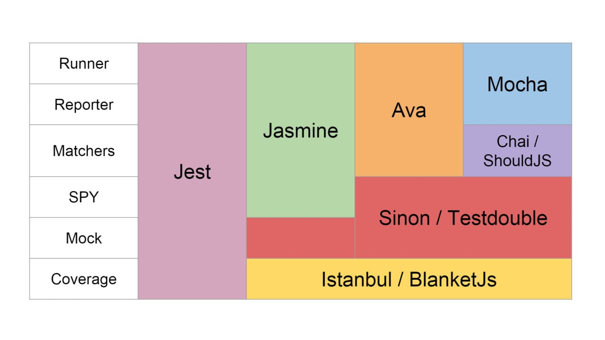

## Jest test

### Запуск тесту: - `npm run test`

[Jest](https://jestjs.io/) - це популярна бібліотека для тестування JavaScript
коду. Вона надає ряд корисних функцій для написання, запуску та аналізу
результатів тестів.

Основні переваги, які роблять бібліотеку Jest дуже популярним інструментом для
тестування JavaScript коду, зокрема для тестування React компонентів та Node.js
додатків:

1. Легкий у використанні: Jest надає простий і легкий у використанні синтаксис
   для написання тестів.
2. Швидкість: Jest швидко виконує тести завдяки вбудованій підтримці
   паралельного виконання тестів.
3. Snapshot тестування: Jest надає можливість тестувати вивід компонентів та
   об'єктів за допомогою "snapshot" тестів, які перевіряють, що вивід не
   змінюється з часом.
4. Mocks: Jest надає засоби для створення моків (фальшивих об'єктів) для
   тестування залежностей.
5. Code coverage: Jest надає можливість вимірювати code coverage - ступінь того,
   яка частка коду була протестована.

Конструкції:

- `describe` - набір тестів
- `test` (або `it`) - тестовий випадок
- `beforeAll` - підготовка перед тестуванням
- `beforeEach` - підготовка для кожного набору чи тестового випадку
- `afterAll` - завершальні дії після тестування
- `afterEach` - завершальні дії для кожного набору чи випадку

### Oсновні методи Expect

які підтримує Jest, інші можна подивитися в
[документації](https://jestjs.io/docs/using-matchers).

- `not` — інвертує наступне порівняння в ланцюжку.
- `expect(func(arg)).toBe(value)` — перевірка на строгу рівність отриманого
  значення value
- `expect(func(arg)).toEqual(value)` — глибоке порівняння якщо повертаються
  значення об'єкт
- `expect(func(arg)).toBeTruthy()` — перевіряє значення на те, що чи можна
  значення, що повертається вважати істинним
- `expect(func(arg)).toBeNull()` — перевіряє значення на рівність null.
- `expect(func(arg)).toBeUndefined()` — перевіряє значення на undefined
- `expect(func(arg)).toBeDefined()` — перевіряє, що функція повертає щось

